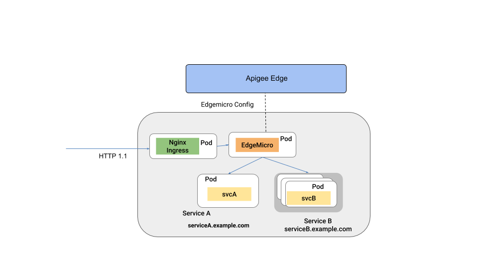
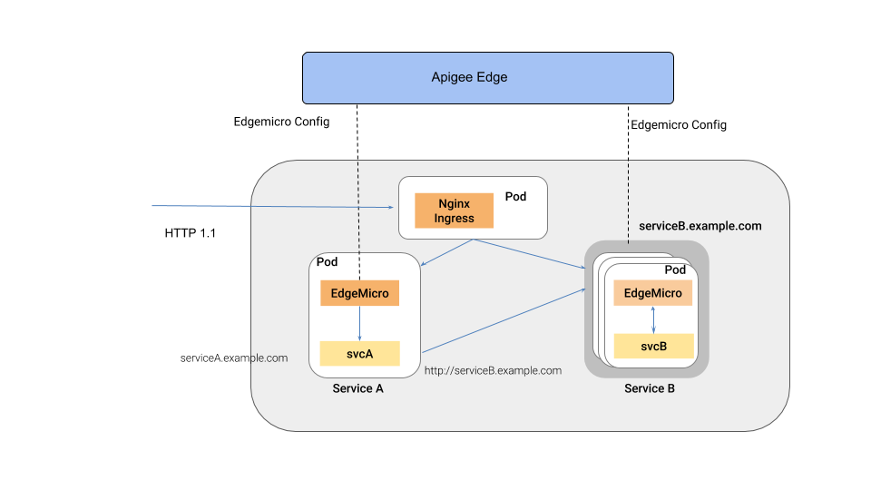
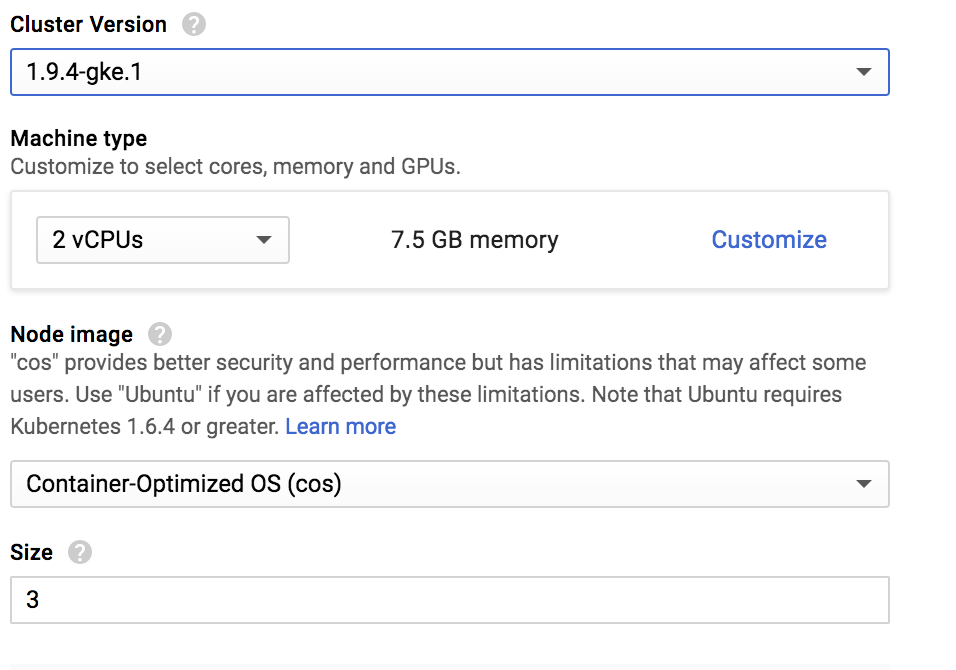

# Microgateway on Kubernetes

## Overview

Edge Microgateway can be deployed as a service or as a sidecar gateway in front og your services deployed in kubernetes cluster. Developers faces challenges in exposing their microservices and rely on API Management providers for exposing,securing and managing their apis. This document explains how to deploy microgateway on the kubernetes platform.

# Edgemicro as Service 

# Edgemicro as Sidecar 


## Quick Start

### Prerequisites

* Kubernetes version 1.8+ or 1.9+(Automatic Sidecar)
* Kubernetes CLI kubectl v1.9 or greater
* Cluster with atleast 3 nodes having 2 VCPU each.
* Minikube - Coming soon ...
* GKE
   - Create container cluster in GKE with atleast 3 node and machine size having 2 VCPU each.
   

   - Retrieve your credentials for kubectl (replace <cluster-name> with the name of the cluster you want to use, and <zone> with the zone where that cluster is located):
     ```
     gcloud container clusters get-credentials <cluster-name> --zone <zone> --project <project-name>
     ```
   - Grant cluster admin permissions to the current user (admin permissions are required to create the necessary RBAC rules for edgemicrok8):
     ```
     kubectl create clusterrolebinding cluster-admin-binding --clusterrole=cluster-admin --user=$(gcloud config get-value core/account)
     ```
* Openshift - Coming soon ...

### Installation Steps

1. If you are using a MacOS or Linux system, you can also run the following command to download and extract the latest release automatically:
      ```
        curl -L https://raw.githubusercontent.com/apigee-internal/microgateway/master/kubernetes/release/downloadEdgeMicrok8s.sh | sh - 
      ```
2. It extracts the package in the current location with a folder named edgemicro-k8-<os>-<arch>
    * Installation .yaml files for Kubernetes in install/
    * Sample applications in samples/
    * The edgemicroctl client binary in the bin/ directory. edgemicroctl is used when manually injecting Edgemicro as a sidecar gateway or Service.

3.  Change directory to edgemicro-k8 package. For example, if the package is edgemicro-k8-0.1-darwinamd64
    ```
    cd  edgemicro-k8-0.1-darwinamd64
    ```
4.  Add the edgemicroctl client to your PATH. For example, run the following command on a MacOS or Linux
system:
    ```
    export PATH=$PWD/bin:$PATH
    ```
5. Install the base edgemicro-k8 setup. This will create edgemicro-system namespaces and create cluster roles for edgemicro sidecar and Service.

    ```
    kubectl apply -f install/kubernetes/edgemicro.yaml
    ```

6. Confgure nginx ingress controller.
    ```
    kubectl apply -f install/kubernetes/edgemicro-nginx-gke.yaml
    ```
    

#### Verify Installation

1. To check if the ingress controller pods have started, run the following command:

    ```
    kubectl get pods --all-namespaces -l app=edgemicro-ingress --watch
    ```
    This takes some time (a minute or two) and may go through cycles of Error and Restarts. Once the operator pods are running, you can cancel the above command by typing Ctrl+C. 
    
    **** Please note that there should not be any other nginx controller running.
2. Ensure the following Kubernetes services are deployed
    ```
    kubectl get svc -n edgemicro-system
    ```
    ```
    NAME                        TYPE           CLUSTER-IP     EXTERNAL-IP    PORT(S)                     AGE
    default-http-backend        ClusterIP      10.19.255.106  <none>         80/TCP                       2h
    edgemicro-ingress           LoadBalancer   10.19.247.156  35.224.24.13   80:30176/TCP,443:32325/TCP   2h
    edgemicro-sidecar-injector  ClusterIP      10.19.240.55   <none>         443/TCP                      2h
    ```
    ** If you have not enabled sidecar injector, you will not see edgemicro-sidecar-injector.Refer Automatic injection section to enable sidecar injector.

3. Verify all pods are running
    ```
    kubectl get pods -n edgemicro-system
     ```
      ```
    NAME                                            READY     STATUS    RESTARTS   AGE
    default-http-backend-55c6c69b88-jf4tn           1/1       Running   0          3h
    edgemicro-ingress-controller-64444469bf-zw8r4   1/1       Running   3          3h
    edgemicro-sidecar-injector-65d78d5cf9-wv6vm     1/1       Running   0          3h
      ```
  
#### Install and Configure Edgemicro

   - Refer [here](https://docs.apigee.com/api-platform/microgateway/2.5.x/installing-edge-microgateway) for more details about installing edgemicro.

        ```
        npm install edgemicro -g
        edgemicro init
        ```
    - Configure Edgemicro to get Key and Secret. You may skip this step if you are doing automatic sidecar injection. The script can generate for you.
        ```
        edgemicro configure -o <org> -e <env> -u <user> -p <password>
        ```
    - Note down the key and secret generated. It also generates org-env-config.yaml file.


## Edgemicro as Service

#### Deploy Edgemicro

- Use edgemicroctl to deploy edgemicro in a kubernetes cluster. It uses the key and secret generated  above .
```
kubectl apply -f <(edgemicroctl -org=<org> -env=<env> -key=<edgemicro-key> -sec=<edgemicro-secret> -conf=<file path of org-env-config.yaml> -img=gcr.io/apigee-microgateway/edgemicro:2.5.16)
```

- Setup nginx ingress controller for edgemicro
```
cat <<EOF | kubectl apply -f -
apiVersion: extensions/v1beta1
kind: Ingress
metadata:
  name: edge-microgateway-ingress
  annotations:
    kubernetes.io/ingress.class: "nginx"
spec:
  rules:
  - http:
      paths:
      - path: /
        backend:
          serviceName: edge-microgateway
          servicePort: 8000
EOF
```

#### Deploy Application 

- Deploy your service without any ingress controller.
```
kubectl apply -f samples/helloworld/hellworld-service.yaml
```

#### Verification Steps 

```
kubectl get services -n default
```
```
NAME                TYPE        CLUSTER-IP     EXTERNAL-IP   PORT(S)          AGE
edge-microgateway   NodePort    10.55.242.99   <none>        8000:31984/TCP   5h
kubernetes          ClusterIP   10.55.240.1    <none>        443/TCP          6h
```

- Get Ingress controller
```
kubectl get ing -o wide
```

```
NAME                HOSTS     ADDRESS         PORTS     AGE
edge-microgateway   *         35.225.100.55   80        5h
```
- Get Ingress IP

```
export GATEWAY_IP=$(kubectl describe ing edge-microgateway --namespace default | grep "Address" | cut -d ':' -f2 | tr -d "[:space:]")

echo $GATEWAY_IP

echo "Call with no API Key:"
curl $GATEWAY_IP:80/hello;
```

- Get ClusterIP for helloworld service

```
kubectl get services helloworld
```


```
NAME         TYPE       CLUSTER-IP      EXTERNAL-IP   PORT(S)          AGE
helloworld   NodePort   10.55.254.255   <none>        8081:30329/TCP   3m
```

- Record the clusterIP to generate the edgemicro api proxy in Edge. For ex - target IP in this case would be http://10.55.254.255:8081. Follow instructions [here](https://docs.apigee.com/api-platform/microgateway/2.5.x/setting-and-configuring-edge-microgateway#part2createentitiesonapigeeedge) to finish apigee setup.

- Call API 
```
echo "Call with API Key:"
curl - 'x-api-key:your-edge-api-key' $GATEWAY_IP:80/hello/echo;echo
```


## Edgemicro as Sidecar

#### Deploy Application

You can now deploy your own application or one of the sample applications provided with the installation like helloworld. Note: the application must use HTTP/1.1 or HTTP/2.0 protocol for all its HTTP traffic because HTTP/1.0 is not supported.

If you started the edgemicro-sidecar-injector, as shown above, you can deploy the application directly using kubectl create. The steps for automatic sidecar injection is mentioned in sections below:

If you do not have the edgemicro-sidecar-injector installed, you must use edgemictoctl to manuallly inject Edgemicro containers in your application pods before deploying them:


```
kubectl apply -f <(edgemicroctl -org=<org> -env=<env> -key=<edgemicro-key> -sec=<edgemicro-secret>  -conf=<file path of org-env-config.yaml> -svc=<your-app-spec>.yaml)
```

Use the svc parameter to pass your service file. See the helloworld sample below for demonstration.


### Helloworld sample
[here](./docs/helloworld.md)

### Automatic Sidecar Injection
[here](./docs/automatic_sidecar.md)

### Running Bookinfo sample
[here](./docs/bookinfo.md)

### Custom Plugins
[here](./../docker/edgemicro/README.md)

### Understanding edgemicroctl

```
Usage: edgemicroctl -org=<orgname> -env=<envname> -user=<username> -pass=<password> -conf=<conf file>

Options:
org  = Apigee Edge Organization name (mandatory)
env  = Apigee Edge Environment name (mandatory)
key  = Apigee Edge Microgateway Key (mandatory)
sec  = Apigee Edge Microgateway Secret (mandatory)
conf = Apigee Edge Microgateway configuration file (mandatory)

For Sidecar deployment
svc  = Kubernetes Service configuration file (mandatory)

For Pod deployment
img  = Apigee Edge Microgateway docker image (mandatory)

Other options:
debug  = Enable debug mode (default: false)


Example for Sidecar: edgemicroctl -org=trial -env=test -conf=trial-test-config.yaml -svc=myservice.yaml -key=xxxx -sec=xxxx -svc=samples/helloworld/helloworld.yaml

Example for Pod: edgemicroctl -org=trial -env=test -conf=trial-test-config.yaml -svc=myservice.yaml -key=xxxx -sec=xxxx
```

### Assumptions
- It uses app labels in services to identify the deployment. Please ensure you define your services with label app. Refer to examples in helloworld and bookinfo example.
- At this point, it also expects service port and container port to be same. Refer examples for more details.


## Uninstall Edgemicro
```
kubectl delete -f install/kubernetes/edgemicro-nginx-gke.yaml
kubectl delete -f install/kubernetes/edgemicro.yaml
gcloud beta container clusters delete edge-micro

```

## References
It uses istio-sidecar-proxy-injector and istio-init docker images from istio project.

## License

Apache 2.0 - See [LICENSE](LICENSE) for more information.
